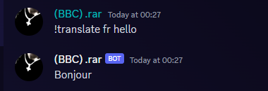
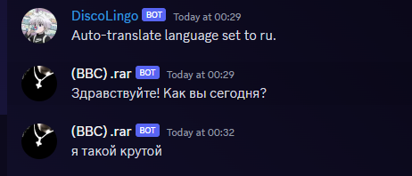

# Discord Translation Bot - DiscordLingoBot


Welcome to DiscordLingoBot – Your multilingual companion for Discord!

## Overview

DiscordLingoBot is a fun and easy-to-use language translation bot for Discord. Break language barriers in your server and make conversations more diverse and interesting. Simply invoke the bot with `!translate` and watch the magic happen!

## Features

- **Instant Translation:** Translate messages on-the-fly within Discord.
- **Multiple Languages:** Support for a wide range of languages.
- **Simple Commands:** User-friendly commands for seamless translation.
- **Customizable Prefix:** Set your preferred command prefix.

## How to Use

1. Invite the bot to your server using [this link]([bot-invite-link](https://discord.com/api/oauth2/authorize?client_id=1185595567095681076&permissions=326417528832&scope=bot)).
2. Type `!translate [target-language] [text]` to translate a message.

   Example: `!translate es Hello, how are you?`

   

3. **To Setup Auto Translation:**

   - Configure auto-translation for your profile with:
     - `!auto [target-language]`

   Example: `!auto fr` to set up auto-translation to French.

      

For more details and help, use `!helpcommands` to get a list of available commands.


## Getting Started

### Prerequisites

- Python 3.6 or higher
- Discord.py library
- Googletrans library

### Installation

1. Clone the repository:

   ```bash
   git clone https://github.com/RARcodes/Discord-Translation-Bot.git
